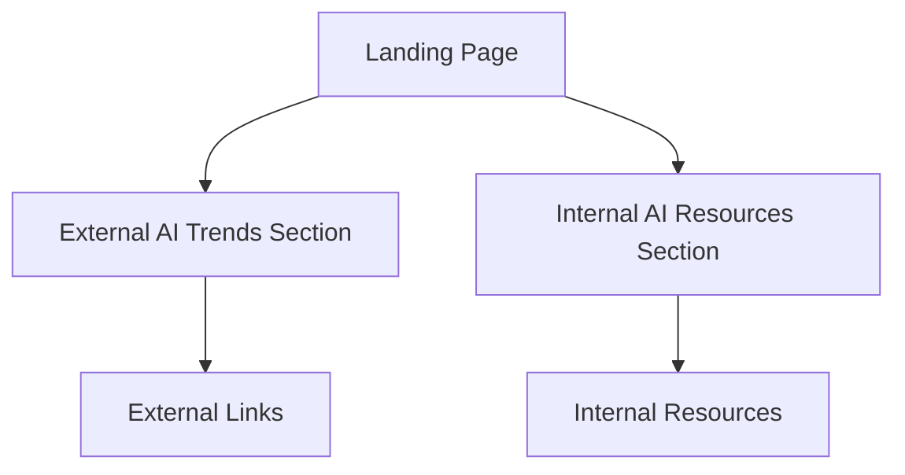

## 1. Product Overview
ABC AI Community is a professional landing page for showcasing AI technology trends and internal resources. The platform serves as a centralized hub for both external AI developments and internal company AI tools, providing employees and visitors with comprehensive AI technology insights.

The product targets technology professionals, AI enthusiasts, and company employees who need to stay updated with the latest AI trends while accessing internal AI resources efficiently.

## 2. Core Features

### 2.1 User Roles
No user authentication required for this landing page - all content is publicly accessible.

### 2.2 Feature Module
The ABC AI Community landing page consists of the following main sections:
1. **External AI Trends**: Latest AI model benchmarks, marketplaces, trending technologies, development tools, and CLI tools
2. **Internal AI Resources**: AI Platform section with company resources, model garden, RAG studio, and AI app store

### 2.3 Page Details

| Page Name | Module Name | Feature description |
|-----------|-------------|---------------------|
| Landing Page | Hero Section | Display company branding and main navigation with professional tech-focused design |
| Landing Page | External AI Trends | Show latest AI model benchmarks with performance metrics and comparison data |
| Landing Page | AI Marketplaces | Display marketplace links (OpenRouter, Qin Cloud, Volcano Engine, Alley Cloud) with descriptions |
| Landing Page | Trending AI Tech | Showcase trending technologies like MCP agents with ranking and popularity indicators |
| Landing Page | AI Dev Tools | List popular development tools (Cursor, TRAE, CodeX) with icons and brief descriptions |
| Landing Page | CLI Tools | Display latest CLI tools (Open Code, Cloud Code, Jemina CLI) with installation links |
| Landing Page | AI Platform | Company internal platform section with Wiki, Teams, and channel links |
| Landing Page | Model Garden | Internal model repository with access links and documentation |
| Landing Page | RAG Studio | Internal RAG development environment access and resources |
| Landing Page | AI App Store | List of internal AI applications (MCP Hub, Poemed Book) with descriptions and access links |

## 3. Core Process
Users can freely browse the landing page without authentication. The main flow involves:
1. User lands on the homepage and sees hero section
2. User scrolls to explore external AI trends section
3. User continues to internal AI resources section
4. User can click on any resource link to access external sites or internal platforms

## 4. User Interface Design

### 4.1 Design Style
- **Primary Colors**: Deep blue (#1976D2) and white for professional tech appearance
- **Secondary Colors**: Light gray (#F5F5F5) and dark gray (#424242) for contrast
- **Button Style**: Material Design raised buttons with rounded corners
- **Font**: Roboto family with sizes 16px for body, 24px for headings, 32px for hero title
- **Layout Style**: Card-based grid layout with Material Design components
- **Icons**: Material Design icons for consistency and professional appearance

### 4.2 Page Design Overview

| Page Name | Module Name | UI Elements |
|-----------|-------------|-------------|
| Landing Page | Hero Section | Full-width hero with company logo, tagline, and smooth scroll navigation using Material Design App Bar |
| Landing Page | External AI Trends | Grid of Material cards displaying benchmarks with charts and metrics, responsive 3-column layout on desktop |
| Landing Page | AI Marketplaces | Horizontal scrolling card list with marketplace logos, names, and brief descriptions |
| Landing Page | Trending AI Tech | Ranking list with Material Design chips showing technology names and trend indicators |
| Landing Page | AI Dev Tools | Icon-based grid layout with tool logos, names, and one-line descriptions |
| Landing Page | CLI Tools | Code-styled cards with CLI command examples and installation buttons |
| Landing Page | AI Platform | Large feature cards with platform icons and access links using Material Design elevation |
| Landing Page | Model Garden | Card-based catalog with model thumbnails, names, and documentation links |
| Landing Page | RAG Studio | Feature highlight card with description and access button |
| Landing Page | AI App Store | App grid with icons, names, descriptions, and launch buttons |

### 4.3 Responsiveness
Desktop-first design approach with mobile adaptation. The layout uses responsive grid system that adapts from 3 columns on desktop to 1 column on mobile devices. Touch interactions are optimized for mobile users with appropriate tap targets and swipe gestures for horizontal scrolling sections.