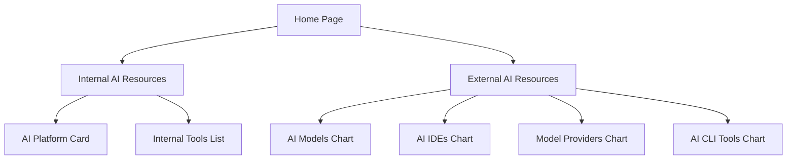

## 1. Product Overview
ABC AI Community is a centralized gateway that empowers colleagues with AI toolings, resources and knowledge. It bridges the internal AI ecosystem and provides easy access to both internal and external AI resources.

The platform serves as a comprehensive hub for AI enthusiasts and professionals within the organization, offering curated lists of tools, models, and educational resources to accelerate AI adoption and learning.

## 2. Core Features

### 2.1 User Roles
This is an internal platform accessible to all colleagues without specific role distinctions. Users can browse and access all resources without authentication requirements.

### 2.2 Feature Module
The ABC AI Community consists of the following main pages:
1. **Home page**: Banner with slogan, AI topics section, navigation to other pages.
2. **Internal AI Resources page**: AI Platform card with three key services, list of internal AI tools.
3. **External AI Resources page**: Four top charts covering AI models, IDEs, providers, and CLI tools.

### 2.3 Page Details
| Page Name | Module Name | Feature description |
|-----------|-------------|---------------------|
| Home page | Banner section | Display slogan "Empowering our colleagues with AI toolings, resources and knowledge. A centralized gateway bridging the internal AI ecosystem" with Apple-like glassmorphism design |
| Home page | AI Topics section | Show 3-4 AI-related topics below banner with engaging visual cards |
| Home page | Navigation | Provide clear navigation links to Internal and External AI Resources pages |
| Internal AI Resources | AI Platform Card | Large prominent card containing three services: Model Garden (list of AI models), RAG Studio (with link and wiki), Document Intelligence (with link and wiki) |
| Internal AI Resources | Internal Tools List | Display list of internal AI tools including AI Platform, RAG Studio, Prompt Book, MCP Hub. Each tool shows owner, direct link, and wiki page link |
| External AI Resources | AI Models Chart | Top 10 most popular AI models sourced from SWE Bench with brief descriptions |
| External AI Resources | AI IDEs Chart | Popular AI IDEs including Cursor, Windsurf, Trae with descriptions and links |
| External AI Resources | Model Providers Chart | Leading model providers like OpenRouter, Together AI, Hugging Face with descriptions |
| External AI Resources | AI CLI Tools Chart | Popular CLI tools including Claude Code, OpenInterpreter, Aider with descriptions |

## 3. Core Process
Users can navigate through the website to discover AI resources:

**Main User Flow:**
1. User lands on Home page and sees the empowering slogan with glassmorphism design
2. User browses AI topics below the banner
3. User navigates to either Internal or External AI Resources based on needs
4. In Internal Resources, user explores AI Platform services and internal tools
5. In External Resources, user discovers top AI models, IDEs, providers, and CLI tools

## 4. User Interface Design

### 4.1 Design Style
- **Primary Colors**: White, light gray, subtle blue accents for glassmorphism effect
- **Secondary Colors**: Soft gradients, translucent overlays
- **Button Style**: Rounded corners with glassmorphism effect, subtle shadows
- **Font**: San Francisco (Apple-like), clean and modern typography
- **Layout Style**: Card-based layout with generous spacing, glassmorphism panels
- **Icon Style**: Minimalist line icons, subtle animations on hover

### 4.2 Page Design Overview
| Page Name | Module Name | UI Elements |
|-----------|-------------|-------------|
| Home page | Banner section | Full-width glassmorphism banner with blurred background, centered slogan text in large, clean font with subtle text shadow |
| Home page | AI Topics | Horizontal scrollable cards with glass panels, each card has icon, title, and brief description |
| Internal AI Resources | AI Platform Card | Large translucent card with frosted glass effect, contains three service sections with icons and links |
| Internal AI Resources | Tools List | Clean table with alternating row colors, each tool has expandable details with owner and links |
| External AI Resources | Charts | Four-column grid layout on desktop, responsive cards for each chart item with rank, name, and description |

### 4.3 Responsiveness
Desktop-first design approach with mobile adaptation. The layout gracefully scales down for tablets and mobile devices, maintaining the glassmorphism aesthetic while optimizing for smaller screens.

### 4.4 Animation Guidelines
- Smooth fade-in animations for page loads
- Subtle hover effects on cards and buttons
- Gentle parallax scrolling on banner
- Smooth transitions between pages
- Micro-animations on interactive elements