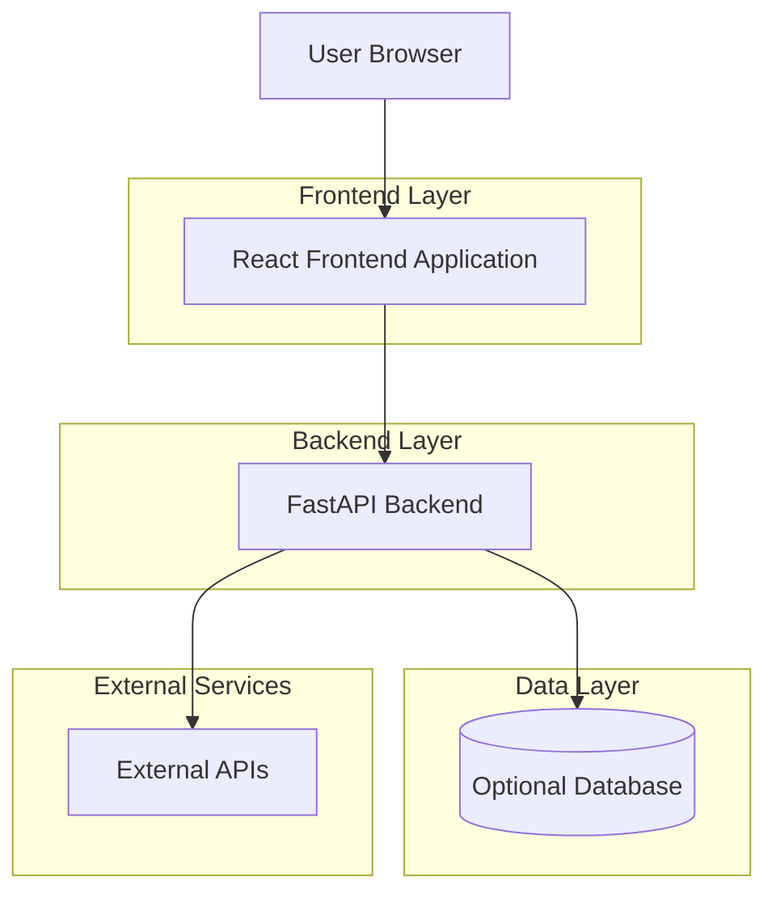
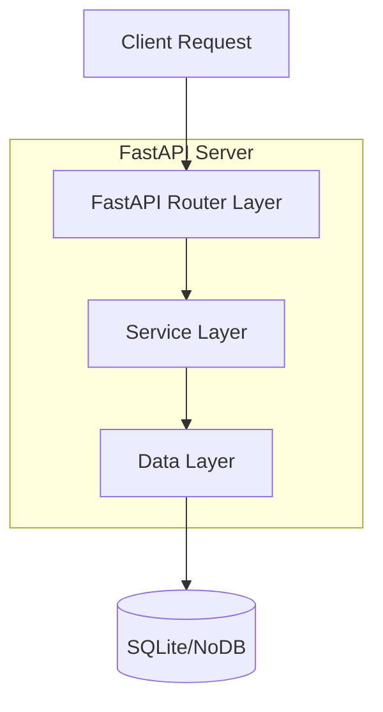
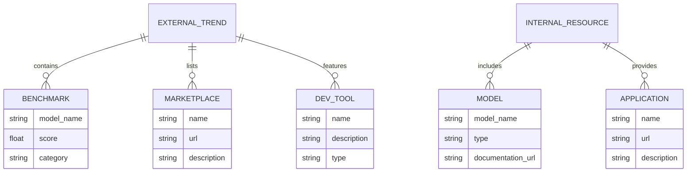

## 1. Architecture design



## 2. Technology Description

* Frontend: React\@18 + Material-UI\@5 + Vite

* Initialization Tool: vite-init

* Backend: FastAPI\@0.104 + Python\@3.12

* Database: Optional SQLite for development (can run without database)

## 3. Route definitions

| Route                   | Purpose                                             |
| ----------------------- | --------------------------------------------------- |
| /                       | Landing page displaying all AI trends and resources |
| /api/health             | Health check endpoint for backend status            |
| /api/external-trends    | Fetch external AI trends data                       |
| /api/internal-resources | Fetch internal AI resources data                    |

## 4. API definitions

### 4.1 Core API

External AI Trends API

```
GET /api/external-trends
```

Response:

| Param Name     | Param Type | Description                            |
| -------------- | ---------- | -------------------------------------- |
| benchmarks     | array      | List of latest AI model benchmarks     |
| marketplaces   | array      | AI marketplace links and descriptions  |
| trending\_tech | array      | Trending AI technologies with rankings |
| dev\_tools     | array      | Popular AI development tools           |
| cli\_tools     | array      | Latest CLI tools for AI development    |

Example Response:

```json
{
  "benchmarks": [
    {
      "model_name": "GPT-4",
      "score": 85.5,
      "category": "Language Model"
    }
  ],
  "marketplaces": [
    {
      "name": "OpenRouter",
      "url": "https://openrouter.ai",
      "description": "Unified API for multiple AI models"
    }
  ],
  "trending_tech": [
    {
      "name": "MCP Agents",
      "rank": 1,
      "trend": "rising"
    }
  ],
  "dev_tools": [
    {
      "name": "Cursor",
      "description": "AI-powered code editor"
    }
  ],
  "cli_tools": [
    {
      "name": "Open Code",
      "command": "npm install -g open-code",
      "description": "Open source code generator"
    }
  ]
}
```

Internal AI Resources API

```
GET /api/internal-resources
```

Response:

| Param Name    | Param Type | Description                              |
| ------------- | ---------- | ---------------------------------------- |
| ai\_platform  | object     | Internal AI platform links and resources |
| model\_garden | array      | Available models in internal garden      |
| rag\_studio   | object     | RAG studio access information            |
| app\_store    | array      | Internal AI applications                 |

Example Response:

```json
{
  "ai_platform": {
    "wiki_url": "https://wiki.company.ai",
    "teams_channel": "https://teams.microsoft.com/ai-community",
    "description": "Central AI platform for ABC company"
  },
  "model_garden": [
    {
      "model_name": "ABC-LLM-v1",
      "type": "Language Model",
      "documentation_url": "/docs/abc-llm"
    }
  ],
  "rag_studio": {
    "name": "RAG Studio",
    "access_url": "/rag-studio",
    "description": "Internal RAG development environment"
  },
  "app_store": [
    {
      "name": "MCP Hub",
      "url": "/apps/mcp-hub",
      "description": "MCP agent management platform"
    }
  ]
}
```

## 5. Server architecture diagram



## 6. Data model

### 6.1 Data model definition

Since the application can run without a database, the data model is optional and can be implemented using in-memory data structures or JSON files for the initial prototype.



### 6.2 Data Definition Language

For optional SQLite implementation:

```sql
-- External trends table
CREATE TABLE external_trends (
    id INTEGER PRIMARY KEY AUTOINCREMENT,
    trend_type VARCHAR(50) NOT NULL,
    name VARCHAR(255) NOT NULL,
    description TEXT,
    url VARCHAR(500),
    score FLOAT,
    category VARCHAR(100),
    created_at TIMESTAMP DEFAULT CURRENT_TIMESTAMP
);

-- Internal resources table
CREATE TABLE internal_resources (
    id INTEGER PRIMARY KEY AUTOINCREMENT,
    resource_type VARCHAR(50) NOT NULL,
    name VARCHAR(255) NOT NULL,
    description TEXT,
    url VARCHAR(500),
    access_level VARCHAR(50) DEFAULT 'public',
    created_at TIMESTAMP DEFAULT CURRENT_TIMESTAMP
);

-- Create indexes for better performance
CREATE INDEX idx_external_trends_type ON external_trends(trend_type);
CREATE INDEX idx_internal_resources_type ON internal_resources(resource_type);
```

