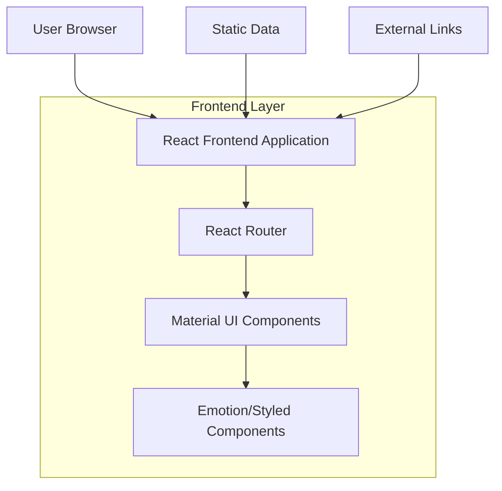

## 1. Architecture Design



## 2. Technology Description
- **Frontend**: React@18 + Material UI@5 + Vite
- **Initialization Tool**: vite-init
- **Styling**: Emotion/Styled Components for glassmorphism effects
- **Routing**: React Router@6
- **Backend**: None (Static site with external links)
- **Animation**: Framer Motion (optional for enhanced animations)

## 3. Route Definitions
| Route | Purpose |
|-------|---------|
| / | Home page with banner slogan and AI topics |
| /internal-resources | Internal AI resources page with AI Platform card and tools list |
| /external-resources | External AI resources page with four top charts |

## 4. Component Architecture

### 4.1 Core Components
```typescript
// Main Layout Components
interface LayoutProps {
  children: React.ReactNode;
}

interface NavigationProps {
  currentPath: string;
}

// Home Page Components
interface BannerProps {
  slogan: string;
  subtitle?: string;
}

interface AITopicCardProps {
  icon: React.ReactNode;
  title: string;
  description: string;
}

// Internal Resources Components
interface AIPlatformCardProps {
  services: {
    modelGarden: ServiceInfo;
    ragStudio: ServiceInfo;
    documentIntelligence: ServiceInfo;
  };
}

interface ServiceInfo {
  name: string;
  link: string;
  wikiLink: string;
  description: string;
}

interface InternalToolProps {
  name: string;
  owner: string;
  link: string;
  wikiLink: string;
  description: string;
}

// External Resources Components
interface ChartItemProps {
  rank: number;
  name: string;
  description: string;
  link?: string;
}

interface TopChartProps {
  title: string;
  items: ChartItemProps[];
  source?: string;
}
```

### 4.2 Data Models
```typescript
// Static Data Types
interface AITopic {
  id: string;
  icon: string;
  title: string;
  description: string;
}

interface InternalTool {
  id: string;
  name: string;
  owner: string;
  link: string;
  wikiLink: string;
  description: string;
  category: 'platform' | 'studio' | 'tool';
}

interface ExternalResource {
  id: string;
  name: string;
  description: string;
  category: 'model' | 'ide' | 'provider' | 'cli';
  rank: number;
  link?: string;
  source: string;
}
```

## 5. Styling Architecture

### 5.1 Glassmorphism Implementation
```typescript
// Styled components for glassmorphism effects
const GlassCard = styled(Card)(({ theme }) => ({
  background: 'rgba(255, 255, 255, 0.1)',
  backdropFilter: 'blur(10px)',
  border: '1px solid rgba(255, 255, 255, 0.2)',
  borderRadius: '16px',
  boxShadow: '0 8px 32px 0 rgba(31, 38, 135, 0.37)',
  transition: 'all 0.3s ease',
  '&:hover': {
    transform: 'translateY(-4px)',
    boxShadow: '0 12px 40px 0 rgba(31, 38, 135, 0.5)',
  },
}));

const GlassBanner = styled('div')(({ theme }) => ({
  background: 'linear-gradient(135deg, rgba(255, 255, 255, 0.1) 0%, rgba(255, 255, 255, 0.05) 100%)',
  backdropFilter: 'blur(20px)',
  border: '1px solid rgba(255, 255, 255, 0.18)',
  boxShadow: '0 8px 32px 0 rgba(31, 38, 135, 0.37)',
}));
```

### 5.2 Material UI Theme Customization
```typescript
// Custom theme for Apple-like design
const theme = createTheme({
  palette: {
    mode: 'light',
    primary: {
      main: '#007AFF', // Apple blue
    },
    secondary: {
      main: '#5856D6', // Apple purple
    },
    background: {
      default: '#F2F2F7', // Apple gray background
      paper: '#FFFFFF',
    },
  },
  typography: {
    fontFamily: '-apple-system, BlinkMacSystemFont, "SF Pro Display", "SF Pro Text", "Helvetica Neue", Helvetica, Arial, sans-serif',
    h1: {
      fontSize: '3rem',
      fontWeight: 600,
    },
    h2: {
      fontSize: '2.5rem',
      fontWeight: 600,
    },
  },
  shape: {
    borderRadius: 12,
  },
  components: {
    MuiCard: {
      styleOverrides: {
        root: {
          borderRadius: 16,
          boxShadow: '0 4px 20px rgba(0, 0, 0, 0.08)',
        },
      },
    },
  },
});
```

## 6. Performance Optimization

### 6.1 Code Splitting
- Implement route-based code splitting using React.lazy()
- Preload critical components for better perceived performance
- Optimize bundle size by tree-shaking unused Material UI components

### 6.2 Image Optimization
- Use WebP format for images with fallbacks
- Implement lazy loading for images below the fold
- Use CSS gradients instead of images where possible for glassmorphism effects

### 6.3 Animation Performance
- Use CSS transforms for animations (GPU accelerated)
- Implement Intersection Observer for scroll-triggered animations
- Minimize reflows and repaints during animations